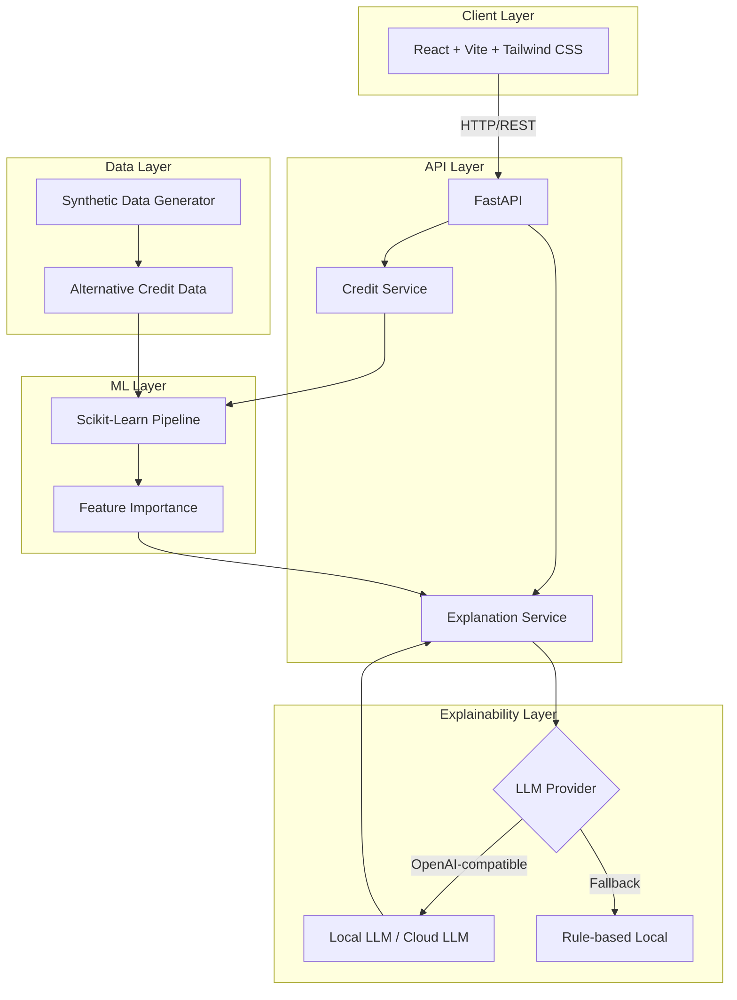

<div align="center">

# 🏦 CreditWise

### An Explainable AI System for Alternative Credit Scoring

[](https://www.python.org/)
[](https://fastapi.tiangolo.com/)
[](https://react.dev/)
[](LICENSE)
[](https://www.docker.com/)

[Features](#-key-features) • [Architecture](#-architecture) • [Quick Start](#-quick-start) • [API Docs](#-api-documentation) • [Contributing](#-contributing)

</div>

---

## 📋 About the Project

**CreditWise** is an alternative credit scoring system that, rather than relying solely on traditional banking history, uses **alternative data sources** — such as utility bill payments, rent, mobile/telecom bills, e-commerce activity, and savings behavior — to assess creditworthiness.

What sets this project apart is its **Explainability Layer**, which uses a local (or cloud-based) LLM to generate clear, transparent, and respectful explanations of credit decisions — tailored separately for the **applicant** and the **bank officer**.

### 🎯 Why This Project?

In many countries, millions of people are excluded from financial services simply because they lack a traditional credit history ("thin file"). This project demonstrates how alternative data combined with explainable AI can help close that gap — giving both applicants and financial institutions a transparent, trustworthy basis for credit decisions.

> **Note :** 
Please note that this is a demo project. It has the potential to add many other features. It is recommended for use for educational purposes.
---

## ✨ Key Features

| Feature | Description |
|---|---|
| 🤖 **Interpretable ML Model** | Logistic Regression built with a Scikit-Learn Pipeline, including preprocessing and feature importance |
| 📊 **Realistic Synthetic Data** | Data generated with Faker using controlled statistical distributions — no real user data required |
| 💬 **AI-Generated Explanations** | Natural-language explanations for both applicants and bank staff, via any OpenAI-compatible endpoint |
| 🛡️ **Automatic Fallback** | Falls back to local rule-based explanations if the LLM is unavailable |
| 📈 **Interactive Dashboard** | Radar and donut charts via Recharts, plus a circular score gauge |
| ⌨️ **Live Typewriter Effect** | LLM-generated explanations render with a typewriter animation |
| 📄 **Professional PDF Export** | Structured reports with full Persian (Vazirmatn) font support |
| 🐳 **Docker-First Setup** | Fully containerized — up and running with a single `docker-compose up` |
| 📚 **Auto-Generated Docs** | Interactive Swagger/OpenAPI documentation at `/docs` |

---

## 🏗️ Architecture



### Data Flow

```
1. The applicant fills out the credit request form
2. FastAPI validates the input (Pydantic)
3. The Credit Service scores the application via the Scikit-Learn Pipeline
4. The Explanation Service generates a rationale:
   - It first attempts to use the LLM (local or cloud)
   - If unavailable, it falls back to a rule-based explanation
5. The React dashboard renders results with charts and a typewriter effect
6. The user can download a PDF report
```

---

## 🛠️ Tech Stack

### Backend
| Technology | Version | Purpose |
|---|---|---|
| Python | 3.11+ | Core language |
| FastAPI | 0.110+ | API framework |
| Scikit-Learn | 1.4+ | ML model |
| Pandas / NumPy | Latest | Data processing |
| Faker | 25+ | Synthetic data generation |
| OpenAI SDK | 1.30+ | LLM connectivity |

### Frontend
| Technology | Version | Purpose |
|---|---|---|
| React | 18+ | UI framework |
| TypeScript | 5+ | Type safety |
| Vite | 5+ | Build tool |
| Tailwind CSS | 3+ | Styling |
| Recharts | Latest | Charts |
| @react-pdf/renderer | Latest | PDF generation |

### Infrastructure
| Technology | Purpose |
|---|---|
| Docker | Containerization |
| Docker Compose | Orchestration |
| Nginx | Frontend serving in production |

---

## 🚀 Quick Start

### Prerequisites

- [Docker](https://www.docker.com/get-started) and [Docker Compose](https://docs.docker.com/compose/install/) (v2+)
- (Optional) A local LLM server such as [LM Studio](https://lmstudio.ai/), [Ollama](https://ollama.ai/), or [LocalAI](https://localai.io/)

### Option 1: Docker (Recommended)

```bash
# 1. Clone the repository
git clone https://github.com/YOUR_USERNAME/creditwise.git
cd creditwise

# 2. Copy the environment file
cp .env.example .env

# 3. (Optional) Edit .env to configure your LLM endpoint
# nano .env  # or use your favorite editor

# 4. Build and run
docker-compose up --build

# 5. Access the application
# Frontend: http://localhost:3000
# Backend API: http://localhost:8000
# API Docs: http://localhost:8000/docs
```

> ⚠️ **Important note for local LLMs:** if your LLM server runs on the host machine (e.g., `http://localhost:20128/v1`), your `.env` file should use `http://host.docker.internal:20128/v1` instead, so the container can reach the host.

### Option 2: Without Docker (Local Development)

#### Backend

```bash
# 1. Create a virtual environment
python -m venv .venv
source .venv/bin/activate  # Linux/macOS
# .venv\Scripts\activate   # Windows

# 2. Install dependencies
pip install -r backend/requirements.txt

# 3. Generate synthetic data
python backend/scripts/generate_synthetic_data.py --rows 10000 --seed 42

# 4. Train the model
python backend/scripts/train_credit_model.py --model logistic --seed 42

# 5. Create backend/.env
cat > backend/.env << EOF
EXPLANATION_PROVIDER=openai
OPENAI_BASE_URL=http://localhost:20128/v1
OPENAI_MODEL=oc/deepseek-v4-flash-free
OPENAI_API_KEY=
EXPLANATION_LANGUAGE=en
EOF

# 6. Run the API
uvicorn app.main:app --app-dir backend --reload --port 8000
```

#### Frontend

```bash
# 1. Install dependencies
cd frontend
npm install

# 2. Run the development server
npm run dev

# 3. Access at: http://localhost:5173
```

---

## 🔧 Configuration (Environment Variables)

| Variable | Default | Description |
|---|---|---|
| `EXPLANATION_PROVIDER` | `local` | `local` (rule-based) or `openai` (LLM-based) |
| `OPENAI_BASE_URL` | `http://localhost:20128/v1` | OpenAI-compatible endpoint URL |
| `OPENAI_MODEL` | `oc/deepseek-v4-flash-free` | Model name on the endpoint |
| `OPENAI_API_KEY` | _(empty)_ | API key (not required for local LLMs) |
| `EXPLANATION_LANGUAGE` | `fa` | Explanation language (`fa`, `en`) |

### Configuration Examples

**Local LLM (LM Studio / Ollama / LocalAI):**
```env
EXPLANATION_PROVIDER=openai
OPENAI_BASE_URL=http://localhost:20128/v1
OPENAI_MODEL=oc/deepseek-v4-flash-free
OPENAI_API_KEY=
```

**OpenAI Cloud:**
```env
EXPLANATION_PROVIDER=openai
OPENAI_BASE_URL=https://api.openai.com/v1
OPENAI_MODEL=gpt-4o-mini
OPENAI_API_KEY=sk-...
```

**No LLM (Fully Offline):**
```env
EXPLANATION_PROVIDER=local
```

---

## 📚 API Documentation

Once the backend is running, interactive Swagger documentation is available at:

```
http://localhost:8000/docs
```

### Main Endpoints

| Method | Path | Description |
|---|---|---|
| `GET` | `/health` | Service and model health check |
| `POST` | `/api/v1/credit/score` | Fast scoring (no explanation) |
| `POST` | `/api/v1/credit/explain` | Scoring + AI-generated explanation |

### Sample Request

```bash
curl -X POST http://localhost:8000/api/v1/credit/explain \
  -H "Content-Type: application/json" \
  -d '{
    "application": {
      "age": 34,
      "employment_type": "salaried",
      "monthly_income": 1200,
      "months_at_current_address": 36,
      "number_of_dependents": 1,
      "has_rent_history": true,
      "rent_payment_on_time_rate": 0.89,
      "utility_payment_on_time_rate": 0.95,
      "telecom_payment_on_time_rate": 0.87,
      "monthly_avg_telco_charge": 32.5,
      "ecommerce_activity_score": 61,
      "digital_wallet_usage_score": 72,
      "savings_behavior_score": 66
    }
  }'
```

---

## 📁 Project Structure

```text
creditwise/
├── backend/
│   ├── app/
│   │   ├── api/v1/          # API routes
│   │   ├── core/            # Config, features
│   │   ├── schemas/         # Pydantic models
│   │   ├── services/        # Business logic
│   │   └── main.py          # FastAPI entry point
│   ├── data/                # Synthetic data
│   ├── models/              # Trained ML models
│   ├── scripts/             # Data generation & training
│   ├── requirements.txt
│   └── Dockerfile
├── frontend/
│   ├── src/
│   │   ├── api/             # API client
│   │   ├── components/      # React components
│   │   ├── hooks/           # Custom hooks
│   │   ├── types/           # TypeScript types
│   │   └── App.tsx
│   ├── Dockerfile
│   └── nginx.conf
├── docs/                    # Data dictionary
├── docker-compose.yml
├── .env.example
└── README.md
```

---

## 🗺️ Roadmap

- [x] Phase 1: Synthetic data generation with Faker
- [x] Phase 2: ML model with a Scikit-Learn Pipeline
- [x] Phase 3: FastAPI with a layered architecture
- [x] Phase 4: Explainability layer with local LLM support
- [x] Phase 5: React dashboard with charts and PDF export
- [x] Phase 6: Docker and documentation
- [ ] Phase 7: Authentication and authorization (JWT)
- [ ] Phase 8: Monitoring with Prometheus + Grafana
- [ ] Phase 9: CI/CD pipeline
- [ ] Phase 10: Advanced models (XGBoost + SHAP)

---


## 🙏 Acknowledgments

- [FastAPI](https://fastapi.tiangolo.com/) — modern, high-performance API framework
- [Scikit-Learn](https://scikit-learn.org/) — ML library
- [React](https://react.dev/) — UI library
- [Tailwind CSS](https://tailwindcss.com/) — CSS framework
- [Recharts](https://recharts.org/) — charting library
- [@react-pdf/renderer](https://react-pdf.org/) — PDF generation
- [Vazirmatn Font](https://github.com/rastikerdar/vazirmatn) — Persian typeface

---

<div align="center">


If you found this project useful, please consider giving it a ⭐!

</div>